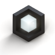

 ---
layout: LandingPage
title:  Windows Mixed Reality Layout Tests
description: A place to test docs platform layouts for the Mixed Reality docs.
keywords: mixed reality developer docs 
---

# Design guidance overview

This guidance is authored by Microsoft designers, developers, program managers, and researchers, whose work spans holographic devices (like HoloLens) and immersive devices (like the Acer and HP Windows Mixed Reality headsets). So, consider this work as a set of topics for ‘how to design for Windows head-mounted displays’.

## Article categories

<ul class="panelContent cardsF">
    <li>
        

            

                

                    

                        

                            
                        

                    

                    

                        <h3>Get started with Design</h3>
                        

                            <a href="Design/Get-started-with-design/What-is-mixed-reality.md">What is mixed reality?</a>
                        

                        

                            <a href="Design/Get-started-with-design/My-first-year-on-the-design-team.md">About this guidance</a>
                        

                        

                            <a href="Design/Get-started-with-design/The-pursuit-of-more-personal-computing.md">The pursuit of more personal computing</a>
                        

                    

                

            

        

    </li>
    <li>
        

            

                

                    

                        

                            
                        

                    

                    

                        <h3>Interaction design</h3>
                        

                            <a href="Design/Interaction-design/Interaction-fundamentals.md">Interaction fundamentals</a>
                        

                        

                            <a href="Design/Interaction-design/Comfort.md">Comfort</a>
                        

                        

                            <a href="Design/Interaction-design/Gaze-targeting.md">Gaze targeting</a>
                        

                        

                            <a href="Design/Interaction-design/Gestures.md">Gestures</a>
                        

                         

                            <a href="Design/Interaction-design/Voice-design.md">Voice design</a>
                        

                    

                

            

        

    </li>
    <li>
        

            

                

                    

                        

                            
                        

                    

                    

                        <h3>Style</h3>
                        

                            <a href="design/basics/design-and-ui-intro.md">Color, light and materials</a>
                        

                         

                            <a href="design/fluent-design-system/index.md">Spatial sound design</a>
                        

                        

                            <a href="design/controls-and-patterns/index.md">Typography</a>
                        

                        

                            <a href="design/downloads/index.md">Scale</a>
                        
                      
                    

                

            

        

    </li>
    <li>
        

            

                

                    

                        

                            
                        

                    

                    

                        <h3>App patterns</h3>
                        

                            <a href="enterprise/index.md">Types of mixed reality apps</a>
                        

                        

                            <a href="packaging/index.md">Room scan visualization</a>
                        

                        

                            <a href="porting/index.md">Cursors</a>
                        

                        

                            <a href="winrt-components/index.md">Billboarding and tag-along</a>
                        

                    

                

            

        

    </li>
    <li>
        

            

                

                    

                        

                            
                        

                    

                    

                        <h3>Controls</h3>
                        

                            <a href="gaming/e2e.md">Text in Unity</a>
                        

                        

                            <a href="gaming/index.md">Interactable object</a>
                        

                        

                            <a href="gaming/directx-programming.md">Object collection</a>
                        

                        

                            <a href="xbox-apps/index.md">Progress</a>
                        

                        

                            <a href="xbox-live/index.md">App bar and bounding box</a>
                        

                    

                

            

        

    </li>    
</ul>

## Resources

<table style="border-collapse:collapse">

	<tr>
		<td style="border-style: none" width="50%"> **[Common controls gallery](../layout/index.md)** What do common controls look like in Mixed Reality? How do they act? Check it out right here, or send them to the headset of your choice.</td>
		<td style="border-style: none"> **[Sample apps](design/sample-apps/Sample-apps.md)** Explore and experiment with sample app experiences created for developers by the Windows Mixed Reality team. These apps showcase our approach to designing great experiences and highlight the opportunities in UI, interaction, and integrated services.</td>
	</tr>
       
</table>

## Design tools

<ul class="panelContent cardsF">
    <li>
        

            

                

                    

                        

                            
                        

                    

                    

                        <h3>Get started with Design</h3>
                        

                            <a href="whats-new/windows-10-build-16299.md">HoloSketch</a>
                        

                        

                            <a href="whats-new/windows-docs-latest.md">Inclusive design at Microsoft</a>
                        

                        

                            <a href="whats-new/experimental-apis.md">Fluent Design System</a>
                        

			 

                            <a href="whats-new/experimental-apis.md">UWP app design and UI</a>
                        

			 

                            <a href="whats-new/experimental-apis.md">3D design tools from Simplygon</a>
                        

                    

                

            

        

    </li>
        <li>
        

            

                

                    

                        

                            
                        

                    

                    

                        <h3>Mixed Reality Toolkit (on GitHub)</h3>
                        

                            <a href="whats-new/windows-10-build-16299.md">Sharing</a>
                        

                        

                            <a href="whats-new/windows-docs-latest.md">Spatial input</a>
                        

                        

                            <a href="whats-new/experimental-apis.md">UnityEditorMotionControllerModel</a>
                        

			 

                            <a href="whats-new/experimental-apis.md">Readme.md</a>
                        

			 

                            <a href="whats-new/experimental-apis.md">Microphone Stream Selector</a>
                        

                    

                

            

        

    </li>
