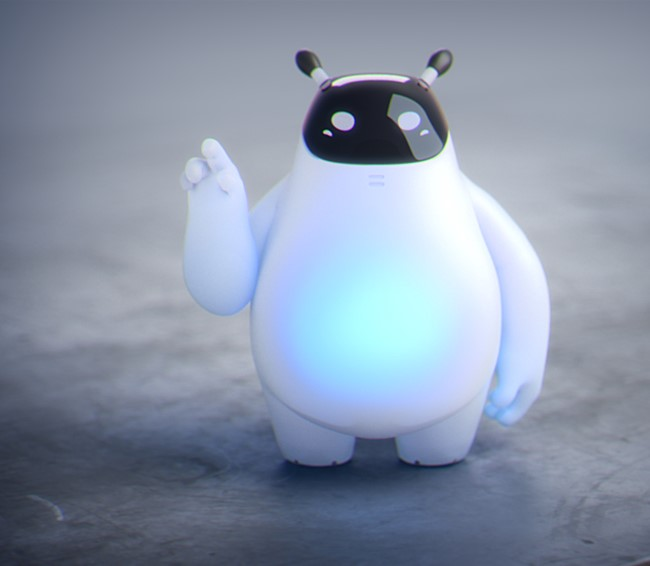
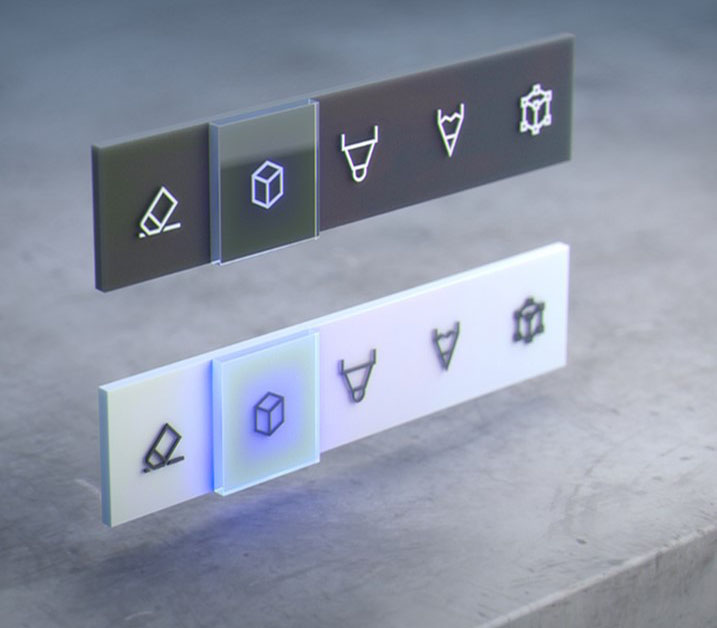
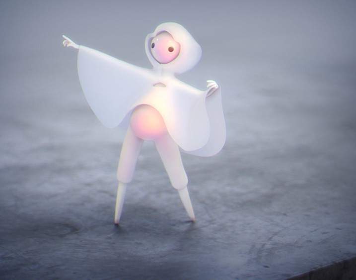
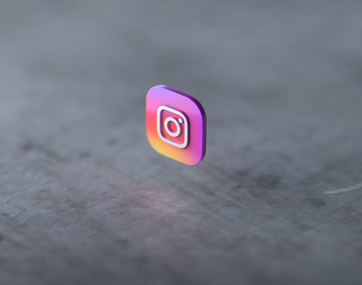
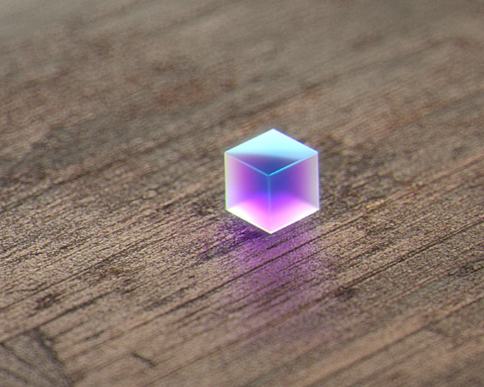

# Design guidance overview

This guidance is authored by Microsoft designers, developers, program managers, and researchers, whose work spans holographic devices (like HoloLens) and immersive devices (like the Acer and HP Windows Mixed Reality headsets). So, consider this work as a set of topics for ‘how to design for Windows head-mounted displays’.

 <table>
 <tr><th>Get started with design</th><th>Interaction design</th><th>Style</th></tr>
 <tr>
<td></td>
<td></td>
<td></td>
 </tr>
 
  <tr><th>App patterns</th><th>Controls</th><th>Sample apps</th></tr>
 <tr>
<td></td>
<td></td>
<td></td>
 </tr>

 </table>
