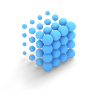

# Design guidance overview

This guidance is authored by Microsoft designers, developers, program managers, and researchers, whose work spans holographic devices (like HoloLens) and immersive devices (like the Acer and HP Windows Mixed Reality headsets). So, consider this work as a set of topics for ‘how to design for Windows head-mounted displays’.

## Markdown

>[!IMPORTANT]
>one

>two

Extra space

>  [!NOTE]
> here's note

## Markdig 

> [!IMPORTANT]
> one
> 
> two

> [!NOTE]
> here's note

* Does a Bullet list have spacing
* between each bullet
* even if there is no line break

1. But a numbered list
2. does not have spacing between lines
3. with no line break?

---

# Give us feedback

Use the Feedback Hub to tell us which features you love, which features you could do without, or when something could be better.

## Feedback for Windows Mixed Reality immersive headset on PC
* Ensure you have the immersive headset connected to your PC.
* Launch **Feedback Hub** on desktop with the HMD connected.
* Go to **Feedback Tab** on the left pane.  
  
* Click **Add new feedback** button to enter a new feedback. 
  
* Select **Problem** in **What kind of feedback is this?** to make feedback actionable.
* Provide meaningful feedback title in **Summarize your issue** box.
* Provide details and repro steps in the **Give us more detail** box. 
  
* Select **Mixed Reality** top category and then pick an applicable sub category:

  |  Subcategory  |  Description | 
  |----------|----------|
  |  Apps  |  Issues with a specific application. | 
  |  Developer  |  Issues in authoring / running an app for Mixed Reality. | 
  |  Device  |  Issues with the HMD itself. | 
  |  Home experience  |  Issues with your VR environment: interactions with the your mixed reality home. | 
  |  Input  |  Issues with input methods: motion controllers, speech, gamepad, or mouse and keyboard. | 
  |  Set up  |  Anything that is preventing you from setting up the device. | 
  |  All other issues  |  Anything else. |
  
* To help us identify and fix the bug faster, capturing traces and video is extremely helpful. To start collecting traces, click on **Start capture**. This will begin collecting traces and a video capture of your mixed reality scenario. 
  
* Leave the Feedback app and run through the broken scenario. Do not close the Feedback Hub app at this point.
* After you are done with your scenario, go back to the feedback app and click **Stop Capture**. Once you do that, you should see that a file containing the traces has been added.
* Click **Submit**. 
  
* This will lead you to Thank You page. 
  
* At this point, your feedback has been successfully submitted.
* After you submit feedback, to easily direct other people (e.g. co-workers, Microsoft staff, [forum](https://forums.hololens.com/) readers et al) to the issue go to Feedback > My Feedback, click on the issue, and use the **Share** icon to get a shortened URL you can give to others to upvote, or escalate.

>[!NOTE]
>Before filing a bug, please ensure you meet the following constraints so that the logs are successfully uploaded with the feedback:
> - Have a minimum of 3GB free disk space available on the main drive of the device.
> - Ensure that a non-metered network is available in order to upload cabs.

## Feedback for HoloLens
1. Use the **bloom** gesture to bring up the Start menu.
2. Select **Feedback Hub** from Start. 
  
3. Place the app in your environment and then select the app to launch it.
4. See if someone else has given similar feedback by entering the topic, such as "Keyboard". 
  
5. If you find similar feedback, select it, add any details, then select **Upvote**. 
  
6. If you don’t find any similar feedback, select **Add new feedback**, and choose a topic from **Select a category** and then **Select a subcategory**. 
  
7. Enter your feedback.
8. If you have a repro, you can click **Reproduce** and repro your feedback, once you are done, come back to Feedback Hub and click **I’m done**. This will collect Mixed Reality Capture of your repro a

---

## Article categories

:::row:::
    :::column:::
        
        ### Get started with Design
        [What is mixed reality?](Design/Get-started-with-design/What-is-mixed-reality.md)
    :::column-end:::
    :::column:::
        
        ### Hello, title
        This is where your content goes.
    :::column-end:::
    :::column:::
        
        ### Hello, title
        This is where your content goes.
    :::column-end:::
:::row-end:::

<ul class="panelContent cardsF">
    <li>
        

            

                

                    

                        

                            
                        

                    

                    

                        <h3>Get started with Design</h3>
                        

                            <a href="Design/Get-started-with-design/What-is-mixed-reality.md">What is mixed reality?</a>
                        

                        

                            <a href="Design/Get-started-with-design/My-first-year-on-the-design-team.md">About this guidance</a>
                        

                        

                            <a href="Design/Get-started-with-design/The-pursuit-of-more-personal-computing.md">The pursuit of more personal computing</a>
                        

                    

                

            

        

    </li>
    <li>
        

            

                

                    

                        

                            
                        

                    

                    

                        <h3>Interaction design</h3>
                        

                            <a href="Design/Interaction-design/Interaction-fundamentals.md">Interaction fundamentals</a>
                        

                        

                            <a href="Design/Interaction-design/Comfort.md">Comfort</a>
                        

                        

                            <a href="Design/Interaction-design/Gaze-targeting.md">Gaze targeting</a>
                        

                        

                            <a href="Design/Interaction-design/Gestures.md">Gestures</a>
                        

                         

                            <a href="Design/Interaction-design/Voice-design.md">Voice design</a>
                        

                    

                

            

        

    </li>
    <li>
        

            

                

                    

                        

                            
                        

                    

                    

                        <h3>Style</h3>
                        

                            <a href="design/basics/design-and-ui-intro.md">Color, light and materials</a>
                        

                         

                            <a href="design/fluent-design-system/index.md">Spatial sound design</a>
                        

                        

                            <a href="design/controls-and-patterns/index.md">Typography</a>
                        

                        

                            <a href="design/downloads/index.md">Scale</a>
                        
                      
                    

                

            

        

    </li>
    <li>
        

            

                

                    

                        

                            
                        

                    

                    

                        <h3>App patterns</h3>
                        

                            <a href="enterprise/index.md">Types of mixed reality apps</a>
                        

                        

                            <a href="packaging/index.md">Room scan visualization</a>
                        

                        

                            <a href="porting/index.md">Cursors</a>
                        

                        

                            <a href="winrt-components/index.md">Billboarding and tag-along</a>
                        

                    

                

            

        

    </li>
    <li>
        

            

                

                    

                        

                            
                        

                    

                    

                        <h3>Controls</h3>
                        

                            <a href="gaming/e2e.md">Text in Unity</a>
                        

                        

                            <a href="gaming/index.md">Interactable object</a>
                        

                        

                            <a href="gaming/directx-programming.md">Object collection</a>
                        

                        

                            <a href="xbox-apps/index.md">Progress</a>
                        

                        

                            <a href="xbox-live/index.md">App bar and bounding box</a>
                        

                    

                

            

        

    </li>    
</ul>

## Resources

<table style="border-collapse:collapse">

	<tr>
		<td style="border-style: none" width="50%"> **[Common controls gallery](../layout/index.md)** What do common controls look like in Mixed Reality? How do they act? Check it out right here, or send them to the headset of your choice.</td>
		<td style="border-style: none"> **[Sample apps](design/sample-apps/Sample-apps.md)** Explore and experiment with sample app experiences created for developers by the Windows Mixed Reality team. These apps showcase our approach to designing great experiences and highlight the opportunities in UI, interaction, and integrated services.</td>
	</tr>
       
</table>

## Design tools

<ul class="panelContent cardsF">
    <li>
        

            

                

                    

                        

                            
                        

                    

                    

                        <h3>Get started with Design</h3>
                        

                            <a href="whats-new/windows-10-build-16299.md">HoloSketch</a>
                        

                        

                            <a href="whats-new/windows-docs-latest.md">Inclusive design at Microsoft</a>
                        

                        

                            <a href="whats-new/experimental-apis.md">Fluent Design System</a>
                        

			 

                            <a href="whats-new/experimental-apis.md">UWP app design and UI</a>
                        

			 

                            <a href="whats-new/experimental-apis.md">3D design tools from Simplygon</a>
                        

                    

                

            

        

    </li>
        <li>
        

            

                

                    

                        

                            
                        

                    

                    

                        <h3>Mixed Reality Toolkit (on GitHub)</h3>
                        

                            <a href="whats-new/windows-10-build-16299.md">Sharing</a>
                        

                        

                            <a href="whats-new/windows-docs-latest.md">Spatial input</a>
                        

                        

                            <a href="whats-new/experimental-apis.md">UnityEditorMotionControllerModel</a>
                        

			 

                            <a href="whats-new/experimental-apis.md">Readme.md</a>
                        

			 

                            <a href="whats-new/experimental-apis.md">Microphone Stream Selector</a>
                        

                    

                

            

        

    </li>
