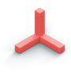

# Windows Mixed Reality documentation

Mixed reality blends real-world and virtual content into hybrid environments where physical and digital objects coexist and interact.

 
<ul id="cardtypes-A" class="cardsA panelContent" style="display: flex; margin-left: 0px;">
                            <li>
                                    

                                        

                                            

                                                

                                                    

                                                        
                                                    

                                                

                                                

                                                    <h3 class="x-hidden-focus">What's new</h3>
                                                    
Get the latest on new APIs and features, what's new in the docs and experimental                                             work.

                                                

                                            

                                        

                                    

                            </li>
                            <li>
                                    

                                        

                                            

                                                

                                                    

                                                        
                                                    

                                                

                                                

                                                    <h3>Get started</h3>
                                                    
Get the tools you need to build apps for Windows, including Windows Mixed Reality apps.

                                                

                                            

                                        

                                    

                            </li>
                            <li>
                                  <a href="DesignLanding.md" title="Design documentation" data-linktype="absolute-path">
                                    

                                        

                                            

                                                

                                                    

                                                        
                                                    

                                                

                                                

                                                    <h3>Design</h3>
                                                    
Get design guidance, build user interface and learn interaction and input.

                                                

                                            

                                        

                                    

                               </a>
                            </li>
                            <li>
                              

                                  

                                      

                                          

                                              

                                                  
                                              

                                          

                                          

                                              <h3>Develop</h3>
                                              
Get development guides, learn the technology and understand the science.

                                          

                                      

                                  

                              

                            </li>
                            <li>
                              

                                  

                                      

                                          

                                              

                                                  
                                              

                                          

                                          

                                              <h3>Academy</h3>
                                              
See code examples, do a coding tutorial and watch guest lectures.

                                          

                                      

                                  

                              

                            </li>
 </ul>

<h2>Resources</h2>

<ul class="panelContent cardsF">
    <li>
        

            

                

                    

                       

                        
                 

             

             

                        <h3>API reference</h3>
                        
<a href="https://../">Windows.Graphics.Holographic</a>

                        
<a href="https://../">Windows.Perception</a>

                        
<a href="http://..">Windows.Perception.Spatial</a>

                        
<a href="https://../">Windows.Perception.Spatial.Surface</a>

                        
<a href="https://../">Windows.UI.Input.Spatial</a>

                        

                    

                

            

    </li>
    <li>
        

            

                

                 

                    

                        
                 

             

             

                        <h3>Mixed Reality Toolkit</h3>
                        
<a href="https://..">Sharing</a>

                        
<a href="https://..">Spatial input</a>

                        
<a href="http://..">Unity Editor Motion Controller model</a>

                        
<a href="http://..">Readme</a>

                        
<a href="http://..">Microphone Stream Selector</a>

                    

                

            

        

    </li>
</ul>

